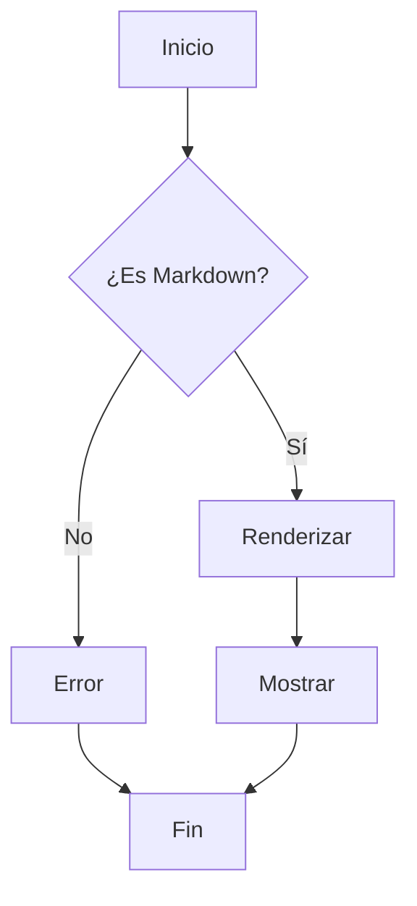
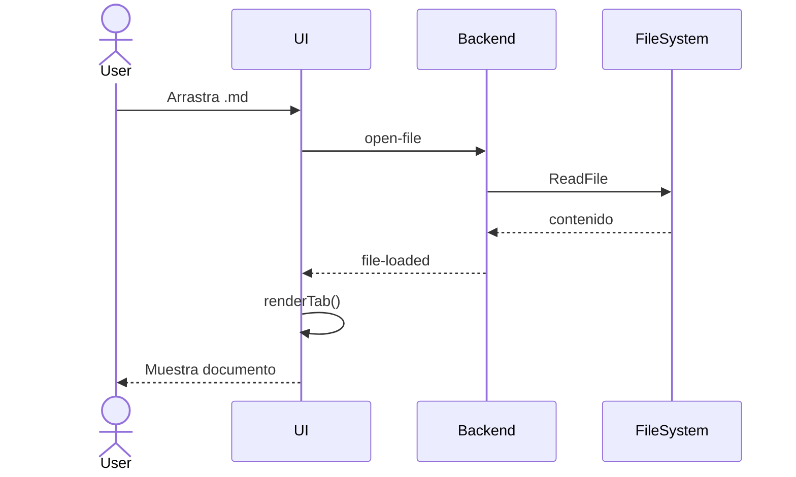
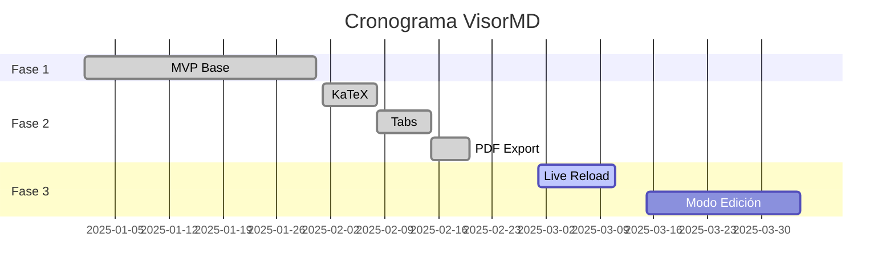
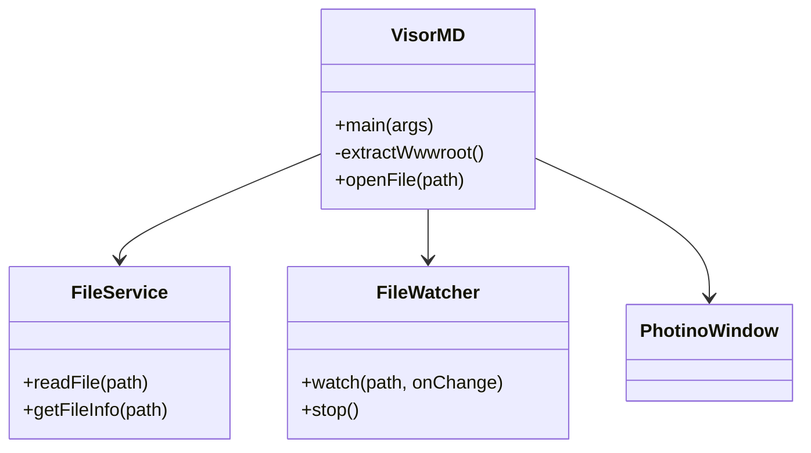
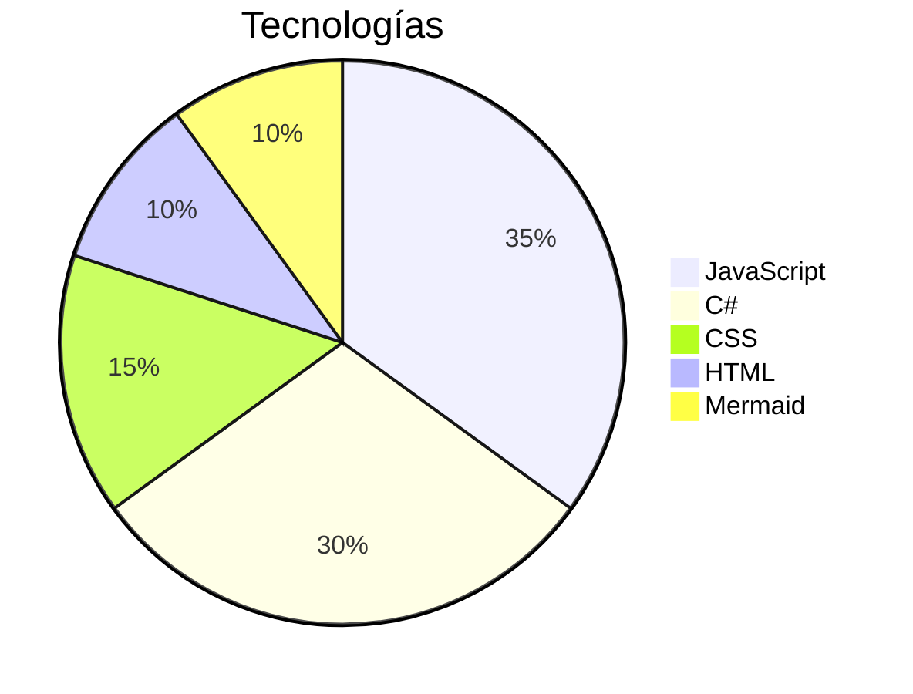

# VisorMD — Prueba Completa

Documento de prueba que cubre todas las funcionalidades del visor.

## Tabla de Contenido

- [Encabezados](#encabezados)
- [Énfasis y Texto](#%C3%A9nfasis-y-texto)
- [Listas](#listas)
- [Enlaces e Imágenes](#enlaces-e-im%C3%A1genes)
- [Código](#c%C3%B3digo)
- [Tablas](#tablas)
- [Notas al Pie](#notas-al-pie)
- [Task Lists](#task-lists)
- [Citas](#citas)
- [Línea Horizontal](#l%C3%ADnea-horizontal)
- [HTML](#html)
- [KaTeX (Fórmulas)](#katex-f%C3%B3rmulas)
- [Diagramas Mermaid](#diagramas-mermaid)
- [Autoenlaces y GFM](#autoenlaces-y-gfm)

---

## Encabezados

# H1
## H2
### H3
#### H4
##### H5
###### H6

## Énfasis y Texto

- *Itálico* con asteriscos
- _Itálico_ con guión bajo
- **Negrita** con asteriscos
- __Negrita__ con guión bajo
- ***Negrita e itálica***
- ~~Tachado~~ (GFM)
- `Código inline`
- <mark>Resaltado HTML</mark>

## Listas

### No ordenada

- Item 1
- Item 2
  - Subitem 2.1
  - Subitem 2.2
    - Subitem 2.2.1
- Item 3

### Ordenada

1. Primero
2. Segundo
   1. Sub segundo
   2. Sub tercero
3. Tercero

### Mixta

1. Paso uno
   - Detalle A
   - Detalle B
2. Paso dos
   1. Paso 2a
   2. Paso 2b

## Enlaces e Imágenes

[VisorMD en GitHub](https://github.com/anomalyco/opencode)

[Enlace con título](https://example.com "Título opcional")


> **Nota**: Para imágenes locales, usa la ruta relativa al archivo `.md`.  
> Ejemplo: `` — crea la carpeta `assets/` junto al `.md`.

## Código

### Código inline

Usa `console.log('hola')` para depurar.

### Bloque sin lenguaje

```
Esto es un bloque de código genérico.
Sin resaltado de sintaxis.
```

### JavaScript

```javascript
function saludar(nombre) {
  const msg = `Hola, ${nombre}!`;
  console.log(msg);
  return msg;
}

saludar('VisorMD');
```

### Python

```python
def fib(n):
    a, b = 0, 1
    for _ in range(n):
        yield a
        a, b = b, a + b

print(list(fib(10)))
# [0, 1, 1, 2, 3, 5, 8, 13, 21, 34]
```

### C#

```csharp
public class Calculadora
{
    public static int Sumar(int a, int b) => a + b;

    public static async Task<string> LeerArchivo(string path)
    {
        return await File.ReadAllTextAsync(path);
    }
}
```

### SQL

```sql
SELECT
    u.nombre,
    COUNT(p.id) AS total_posts
FROM usuarios u
LEFT JOIN posts p ON p.usuario_id = u.id
WHERE u.activo = 1
GROUP BY u.id
HAVING total_posts > 5
ORDER BY total_posts DESC;
```

### Rust

```rust
fn main() {
    let nums = vec![1, 2, 3, 4, 5];
    let sum: i32 = nums.iter().map(|x| x * 2).sum();
    println!("Suma duplicada: {}", sum);
}
```

## Tablas

### Tabla simple

| Nombre   | Edad | Ciudad    |
|----------|------|-----------|
| Ana      | 28   | Madrid    |
| Carlos   | 35   | Barcelona |
| Elena    | 22   | Valencia  |

### Tabla con alineación

| Izquierda | Centro | Derecha |
|:----------|:------:|--------:|
| texto     | texto  |   texto |
| alineado  | alineado | alineado |

### Tabla con formato interno

| Feature       | Estado | Prioridad |
|---------------|:------:|----------:|
| Markdown      | ✅ Hecho | Alta      |
| Mermaid       | ✅ Hecho | Alta      |
| **KaTeX**     | ✅ Hecho | Alta      |
| `Tabs`        | ✅ Hecho | Media     |
| Export PDF    | ✅ Hecho | Media     |
| ~~Live Reload~~ | ❌ Pendiente | Baja    |

## Notas al Pie

Esto tiene una nota al pie[^1] y otra más[^2].

[^1]: Esta es la primera nota con detalles.
[^2]: Segunda nota — también funciona con **formato** y `código`.

## Task Lists

- [x] Tarea completada
- [x] KaTeX implementado
- [x] Tabs implementados
- [ ] Live reload
- [ ] Modo edición
- [ ] Soporte para imágenes locales

## Citas

> Esto es una cita.
>
> Puede tener múltiples párrafos.
>
> > Y anidar citas.

## Línea Horizontal

---

## HTML

<p style="color: var(--accent);">Texto con color usando el tema actual.</p>

<details>
<summary>Click para expandir</summary>

Contenido oculto con **markdown** dentro de HTML.

- Lista dentro de detalles
- Más items
</details>

## KaTeX (Fórmulas)

### Inline

Cuando $E = mc^2$ y $\int_a^b f(x)\,dx$, se ve limpio inline.

La identidad de Euler: $e^{i\pi} + 1 = 0$.

### Bloque

$$
\sum_{k=1}^{n} k = \frac{n(n+1)}{2}
$$

$$
f(x) = \frac{1}{\sigma\sqrt{2\pi}} e^{-\frac{1}{2}\left(\frac{x-\mu}{\sigma}\right)^2}
$$

### Matrices

$$
\begin{pmatrix}
a & b \\
c & d
\end{pmatrix}
\quad
\begin{bmatrix}
1 & 2 & 3 \\
4 & 5 & 6
\end{bmatrix}
$$

### Álgebra lineal

$$
\det(A) = \begin{vmatrix}
a & b \\
c & d
\end{vmatrix} = ad - bc
$$

### Series

$$
\sum_{n=1}^{\infty} \frac{1}{n^2} = \frac{\pi^2}{6}
$$

## Diagramas Mermaid

### Flowchart



### Diagrama de Secuencia



### Diagrama de Gantt



### Diagrama de Clases



### Gráfico circular



## Autoenlaces y GFM

URL automática: https://github.com

Email: ejemplo@correo.com

Combinado: `Ctrl+O` para abrir archivo.

> [!NOTE]
> Esto es una nota al estilo GitHub (no todos los visores lo soportan).
