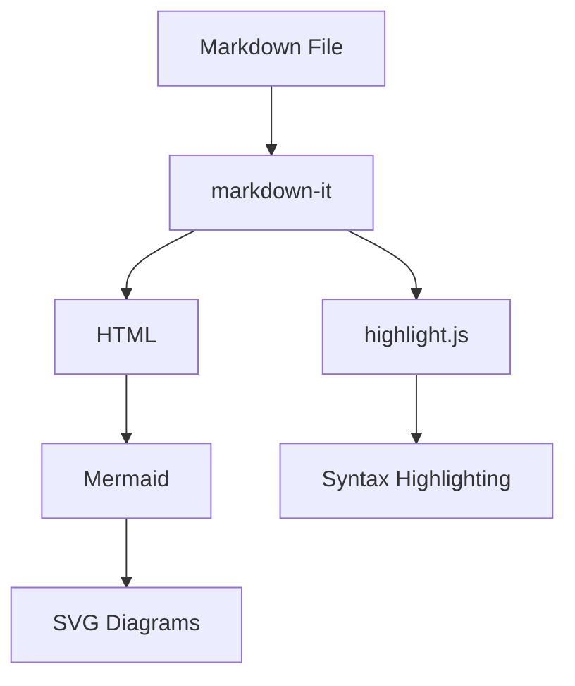
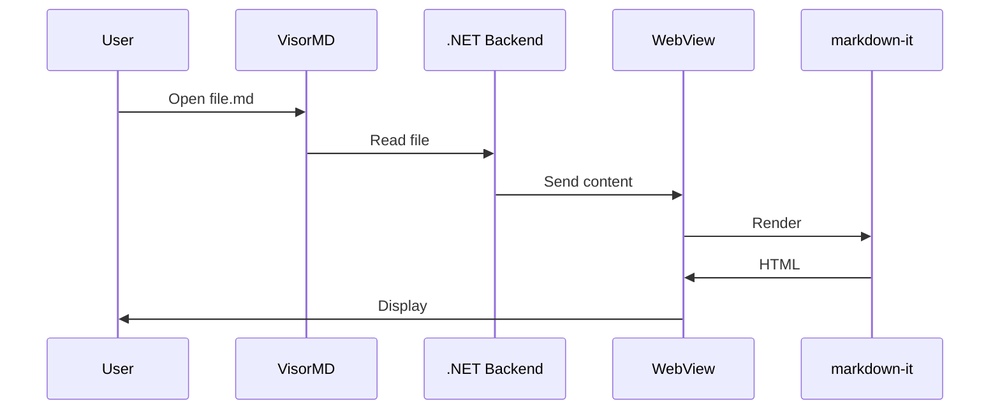

# VisorMD — Test Document

## Features

- **GFM Tables**
- Task lists
- Code blocks with syntax highlighting
- Mermaid diagrams

## Table

| Feature | Status |
|---------|--------|
| GFM | ✅ |
| Mermaid | ✅ |
| Highlight.js | ✅ |
| TOC | ✅ |
| Search | ✅ |

## Task List

- [x] Project structure
- [x] PhotinoX window
- [x] File service
- [x] Markdown rendering
- [ ] PDF export (Phase 2)
- [ ] Live reload (Phase 2)

## Code

```javascript
function hello() {
  console.log("Hello, VisorMD!");
}
```

```python
def fibonacci(n):
    return n if n <= 1 else fibonacci(n-1) + fibonacci(n-2)
```

## Mermaid





## Blockquotes

> This is a blockquote.
> It can span multiple lines.

## Lists

1. First item
2. Second item
3. Third item

- Bullet point A
- Bullet point B
- Bullet point C

## Formatting

**Bold**, *italic*, ~~strikethrough~~, `inline code`.

---

*End of test document.*
